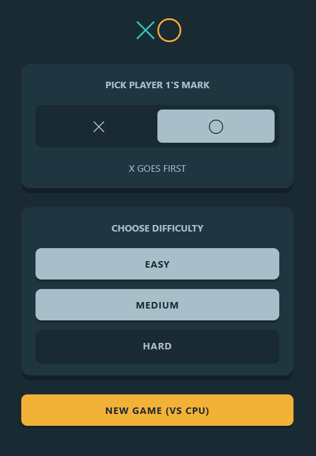

# Tic-Tac-Toe Game

<p align="center">
  <!-- License -->
  <a href="https://github.com/ramazancetinkaya/tictactoe/blob/main/LICENSE">
    
  </a>
  <!-- Issues -->
  <a href="https://github.com/ramazancetinkaya/tictactoe/issues">
    
  </a>
  <!-- Stars -->
  <a href="https://github.com/ramazancetinkaya/tictactoe/stargazers">
    
  </a>
  <!-- Forks -->
  <a href="https://github.com/ramazancetinkaya/tictactoe/network">
    
  </a>
  <!-- Version -->
  
</p>
<p align="center">
  <!-- Languages -->
  
  
  
</p>

## Overview

A classic Tic-Tac-Toe game built with a modern, responsive design and a focus on a pure vanilla JavaScript, HTML, and CSS stack. Challenge yourself against a custom-built AI with three distinct difficulty levels, designed to provide a fun and challenging experience without relying on external frameworks.

## Demo

View the live demo on GitHub Pages:

[](https://ramazancetinkaya.github.io/tictactoe/)

## Features

- Human vs. Computer(CPU)
- 3 AI Difficulty Levels (Easy, Medium, Hard)
- Player Symbol Selection (X or O)
- Fully Responsive Design (Mobile, Tablet, Desktop)
- Session Score and Tie Tracking
- Variable AI Move Delay for Realistic Pacing

### A closer look at AI movements

The AI was developed without using the traditional Minimax algorithm. Instead, it relies on a heuristic-based expert system that evaluates the game state based on a clear hierarchy of strategic priorities.

### Hard Level
The "Hard" AI acts as a near-perfect opponent by following a deterministic priority list for its moves:
1.  **Win:** If it has an immediate winning move, it takes it.
2.  **Block:** If the player has an immediate winning move, it blocks it.
3.  **Fork:** It looks for opportunities to create two winning threats simultaneously.
4.  **Block Fork:** It identifies and blocks the opponent's potential forking moves.
5.  **Control Strategic Positions:** It prioritizes taking the center, then opposite corners, and finally any remaining corners before defaulting to side positions.

### Medium Level
This AI uses a subset of the "Hard" AI's logic (Win, Block, Center Control) but introduces **probabilistic error injection**. There is a calculated chance (~25%) on each turn that it will ignore the optimal move and instead choose a random, often suboptimal, one. This simulates a skilled player who is prone to making occasional mistakes.

### Easy Level
The "Easy" AI is primarily a **reactive and defensive** agent. Its main priority is to block the player from winning. It only rarely checks for its own winning opportunities and will otherwise make random moves, simulating a beginner player.

## Screenshots

<div align="center">

| Main Menu Screenshot |
| :---: |
|  |

</div>

## Installation and Usage

### Option 1: Git Clone

If you have Git installed, use the following command to clone the repository:

```bash
git clone https://github.com/ramazancetinkaya/tictactoe.git
```

Navigate to the project directory:

```bash
cd tictactoe
```

Open `index.html` in your web browser to use the application.

### Option 2: ZIP Download

1. Visit the repository at `https://github.com/ramazancetinkaya/tictactoe`
2. Click the "Code" button
3. Select "Download ZIP" from the dropdown menu
4. Extract the ZIP file to your preferred location
5. Open the extracted folder
6. Open `index.html` in your web browser to use the application

## How to Play

1.  **Choose Your Mark:** Select whether you want to play as `X` or `O`.
2.  **Select Difficulty:** Pick a difficulty level for the AI opponent: `Easy`, `Medium`, or `Hard`.
3.  **Start the Game:** Click the "New Game" button to begin.
4.  **Make Your Move:** Click on any empty square on the board to place your mark.
5.  **Goal:** Be the first to get three of your marks in a row—horizontally, vertically, or diagonally—to win the round.

## Tech Stack

- HTML5
- CSS3 (Vanilla)
- JavaScript (ES6+, Vanilla)
- Bootstrap Icons

## Browser Compatibility

Tested and working on:
- Chrome (latest)
- Firefox (latest)
- Safari (latest)
- Edge (latest)
- Mobile browsers (iOS Safari, Android Chrome)

## Contributing

Contributions are welcome! Please feel free to submit a pull request or open an issue for any enhancements or bug fixes.

## License

This project is licensed under the MIT License. See the [LICENSE](LICENSE) file for more details.

```
MIT License

Copyright (c) 2025 Ramazan Çetinkaya

Permission is hereby granted, free of charge, to any person obtaining a copy
of this software and associated documentation files (the "Software"), to deal
in the Software without restriction, including without limitation the rights
to use, copy, modify, merge, publish, distribute, sublicense, and/or sell
copies of the Software, and to permit persons to whom the Software is
furnished to do so, subject to the following conditions:

The above copyright notice and this permission notice shall be included in all
copies or substantial portions of the Software.

THE SOFTWARE IS PROVIDED "AS IS", WITHOUT WARRANTY OF ANY KIND, EXPRESS OR
IMPLIED, INCLUDING BUT NOT LIMITED TO THE WARRANTIES OF MERCHANTABILITY,
FITNESS FOR A PARTICULAR PURPOSE AND NONINFRINGEMENT. IN NO EVENT SHALL THE
AUTHORS OR COPYRIGHT HOLDERS BE LIABLE FOR ANY CLAIM, DAMAGES OR OTHER
LIABILITY, WHETHER IN AN ACTION OF CONTRACT, TORT OR OTHERWISE, ARISING FROM,
OUT OF OR IN CONNECTION WITH THE SOFTWARE OR THE USE OR OTHER DEALINGS IN THE
SOFTWARE.
```

## Author

Developed and designed by **Ramazan Çetinkaya**
- GitHub: [ramazancetinkaya](https://github.com/ramazancetinkaya)

## Acknowledgements

- Special thanks to the open-source community for inspiration
